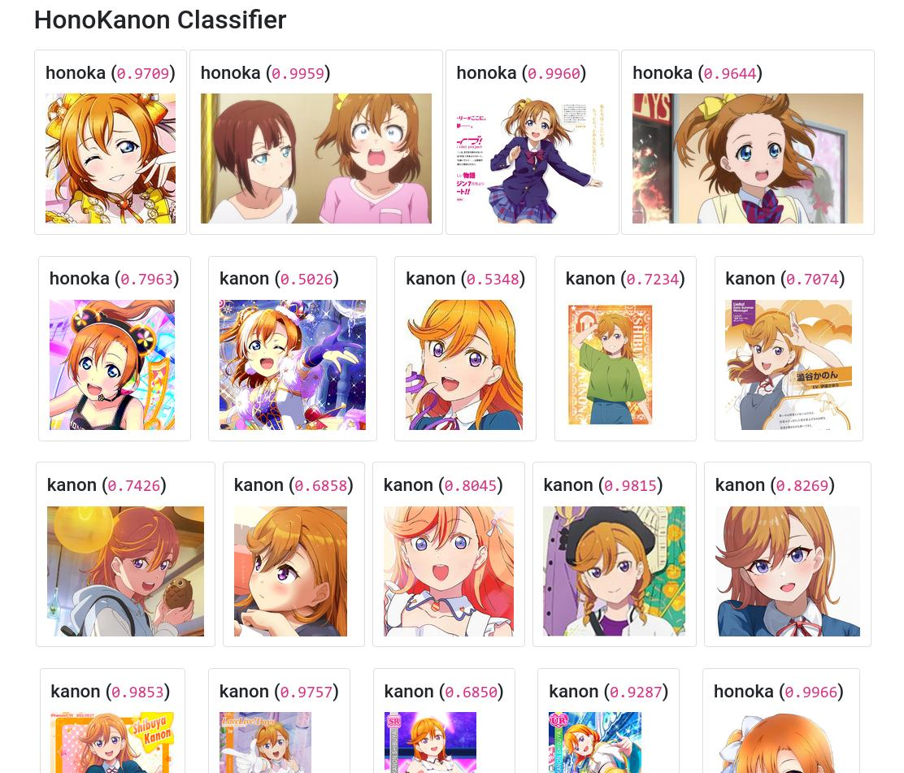

# HonoKanon Classifier

## Introduction
This is a simple project using MobileNet v2 to predict whether an image is of Shibuya Kanon or Kousaka Honoka.  
Trained using weights from `imagenet` for initialization.  
Trained on around carefully selected images of each character (around 3000 for Shibuya Kanon and 3700 for Kousaka Honoka).

  
Prediction result with images in a different distribution than in the train/dev set.

## Training result
- Train accuracy: 0.93
- Test accuracy: 0.91

## Content of this project 
- The notebook used to train this model.
- The Keras model folder.
- The `predict.py` file: gather all images from `input` folder, predict and run a web server to show the result.
- The `web` folder contains code for the mini web server to show the prediction result.
- No data (aka. images of Shibuya Kanon and Kousaka Honoka) is provided.

## How to use
- Put input images into `input` folder, then execute the `predict.py` file.
